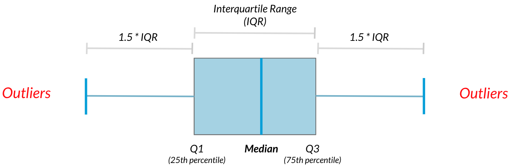

```{r setup, include=FALSE}
knitr::opts_chunk$set(echo = TRUE)
```

Prerequisites
```{r}
library(tidyverse)
```


# Introduction to Staistics with R

## Summary Statistics

### What is Statistics?

### What Statistics can do?

### What statistics can't do?

### Types of statistics

There are 2 main branches of statistics: 

- descriptive statistics and 
- inferential statistics. 

Descriptive statistics focuses on describing and summarizing the data at hand. After asking four friends how they get to work, we can see that 50% of them drive to work, 25% ride the bus, and 25% bike. These are examples of descriptive statistics. 

Inferential statistics uses the data at hand, which is called sample data, to make inferences about a larger population. We could use inferential statistics to figure out what percent of people drive to work based on our sample data.

- Central Tendency - Mean, Median, Mode
- Measures of spread - Quantile, Quartile, spread, variance/SD
- Outliers




## Probability Distributions

### Discrete distributions

Let us conisder theoritical possibilities of rolling a `dice`
```{r}
dice <- data.frame(roll=1:6)
dice
```
Let us see the 10 rolls of this dice
```{r}
set.seed(123)
dice %>% 
  slice_sample(n=10, replace = TRUE) %>% 
  ggplot(aes(roll)) +
  geom_histogram(bins = 6)
```

Whereas theoretically, it should have been-


```{r  fig.show="hold", out.width="50%", echo=FALSE}
par(mar = c(4, 4, .1, .1))
set.seed(123)
dice %>% 
  slice_sample(n=10, replace = TRUE) %>% 
  ggplot(aes(roll)) +
  geom_histogram(fill='darkgrey', bins=6, color='seagreen') +
  ylim(0,10)+
  labs(title = "Sample 10 rolls of a fair dice")

dice %>% 
  ggplot(aes(roll)) +
  geom_histogram(aes(y= ..density..),  fill='darkgrey', bins=6, color='seagreen') +
  ylim(0,1)+
  labs(title = "Theoritical Probability of a fair dice",
       y = 'probability')

```

What if we had taken a bigger sample say 1000 rolls of the dice

```{r  fig.show="hold", out.width="50%", echo=FALSE}
par(mar = c(4, 4, .1, .1))
set.seed(123)
dice %>% 
  slice_sample(n=1000, replace = TRUE) %>% 
  ggplot(aes(roll)) +
  geom_histogram(fill='darkgrey', bins=6, color='seagreen') +
  ylim(0, 1000)+
  labs(title = "Sample 1000 rolls of a fair dice")

dice %>% 
  ggplot(aes(roll)) +
  geom_histogram(aes(y= ..density..),  fill='darkgrey', bins=6, color='seagreen') +
  ylim(0,1)+
  labs(title = "Theoritical Probability of a fair dice",
       y = 'probability')

```

We can see that mean of sample distribution reaches near the theoritical/population mean, which is actually __the Law of Large Numbers.__


## Continuous Distributions

## Continuous Uniform Distribution

Take an example - may be of bus wait/hard-disk back_up


`punif()` function

So if a Hard disk is backed up every 40 minutes, the _theoritical_ probability of waiting say 20 minutes of less would be
```{r}
punif(20, min=0, max=40)
```

Let's sample these wait times, say 1000 times

```{r}
set.seed(123)
data.frame(x=1:1000) %>% 
  mutate(waiting_time=runif(1000, 0, 40)) %>% 
  ggplot(aes(waiting_time)) +
  geom_histogram(bins = 40)
```

What if we had simulated this 10,000 times or say 10,00,000 times

```{r  fig.show="hold", out.width="50%", echo=FALSE}
par(mar = c(4, 4, .1, .1))
set.seed(123)

data.frame(x=1:10000) %>% 
  mutate(waiting_time=runif(10000, 0, 40)) %>% 
  ggplot(aes(waiting_time)) +
  geom_histogram(bins = 40) +
  labs(title = "Sample wait times - 10,000 experiments")
data.frame(x=1:1000000) %>% 
  mutate(waiting_time=runif(1000000, 0, 40)) %>% 
  ggplot(aes(waiting_time)) +
  geom_histogram(bins = 40) +
  labs(title = "Sample wait times - 10,00,000 experiments")
```

## Binomial Distribution

Upon flipping a coin, we can either get a head or a tail, i.e. two possibilities each with equal probability (assuming the coin is fair, of course).  Thus, getting two outcomes or in other words binary outcomes represent an example of binary probability distribution. Two outcomes can also be referred as pass or fail; win or loss; 0 or 1; success or failure etc.

Mathematically, if $p$ is probability of success, then expected mean $\mu = np$ in $n$ independent trials, and variance $\sigma^2 = n p (1-p)$

`rbinom()` function

```{r}
set.seed(1234)
# 10 flips of 1 fair coin (prob = 0.5)
rbinom(10, 1, 0.5)
# 1 flip of 10 fair coins 
rbinom(1, 10, 0.5)
# 6 flips of 5 fair coins
rbinom(6, 5, 0.5)
```
If coin is biased change `prob` argument accordingly.

Thus to define binomial distribution: __The binomial distribution describes the probability of the number of successes in a sequence of independent trials.__


```{r echo=FALSE}
data.frame(heads = 0:10, prob = dbinom(x = 0:10, size = 10, prob = 0.5)) %>%
  mutate(Heads = ifelse(heads == 2, "2", "other")) %>%
ggplot(aes(x = factor(heads), y = prob, fill = Heads)) +
  geom_col() +
  geom_text(
    aes(label = round(prob,2), y = prob + 0.01),
    position = position_dodge(0.9),
    size = 3,
    vjust = 0
  ) +
  labs(title = "Probability of X = 2 successes(Heads).",
       subtitle = "Flip of 10 fair coins",
       x = "Successes (x)",
       y = "probability") 
```

- Trials should be independent

- `pbinom()` function
What is the probability of <=5 heads in 10 coin flips where probability of heads is 0.3?
```{r}
# expected 
pbinom(q = 5, size = 10, p = 0.3, lower.tail = TRUE)
```
 Silulated for 1000 independent trials
```{r}
# simulated
set.seed(123)
mean(rbinom(n = 10000, size = 10, prob = 0.3) <= 5)
```
 We can see that for n large as 10,000 is near to expected value.
 
```{r echo=FALSE}
data.frame(heads = 0:10, 
           pmf = dbinom(x = 0:10, size = 10, prob = 0.3),
           cdf = pbinom(q = 0:10, size = 10, prob = 0.3, 
                        lower.tail = TRUE)) %>%
  mutate(Heads = ifelse(heads <= 5, "<=5", "other")) %>%
ggplot(aes(x = factor(heads), y = cdf, fill = Heads)) +
  geom_col() +
  geom_text(
    aes(label = round(cdf,2), y = cdf + 0.01),
    position = position_dodge(0.9),
    size = 3,
    vjust = 0
  ) +
  labs(title = "Probability of X <= 5 successes.",
       subtitle = "b(10, .3)",
       x = "Successes (x)",
       y = "probability")

```
 
Exercise- _A pharmaceutical company claims that a new vaccine is successful in preventing disease in more than 60% of the cases. The treatment was tried on 100 randomly selected cases and 25 were successful. What about company’s claim?_

```{r}
#probability of success in 100 trials
pbinom(25, 100, 0.6)
#expected value
100 * 0.6
# Interval of +/- 3 SD
100 * 0.6 - (3 * sqrt(100 * 0.6 * 0.4))
100 * 0.6 + (3 * sqrt(100 * 0.6 * 0.4))
```
Thus observed mean is not within +/- 3 times SD of theoretical mean, and thus lies in extreme tails.

## Normal Distribution

Most Important distribution, as it applies on real world situations than any other distribution.

Properties -

- Distribution looks like bell shape which gives it name bell curve
- Area under the curve, like any other probability distribution = 1
- symmetric, described by mean and SD
- the probability never hits 0, even if it looks like it at the tail ends.
- 68% of area lies within +/-1 SD; 95% within +/- 2 SD and; 99.7% within +/- 3 SD


Functions

- `rnorm()`
- `pnorm()`
- `dnorm()`
- `qnorm()`


### Why so important?  Central Limit Theorem (CLT)

Let's us understand this with an example-

What if a fair dice is rolled up? We should get a number 1 to 6, with equal probability. Mean value should be around 3.5 theoretically. Let's roll a dice 5 times.
```{r}
sample(1:6, 5, replace=TRUE) %>% mean()
```
So if same experiment (rolling dice 5 times) is repeated, we will actually get a different mean.
```{r}
sample(1:6, 5, replace=TRUE) %>% mean()
```
Let's perform the result 1000 times and 100,000 times once again; and plot the results to see the mean each of the time
```{r fig.show="hold", out.width="50%", echo=FALSE}
hist(replicate(1000, sample(1:6, 5, replace=TRUE) %>% mean()), xlab = "Mean Value", main = "Replicating 1000 times")
hist(replicate(100000, sample(1:6, 5, replace=TRUE) %>% mean()), xlab = "Mean Value", main = "Replicating 100,000 times")
```
We can see that as the number of times we replicate the experiment, the distribution of sample resembles normal distribution.  This is central limit theorem.

Central Limit Theorem states that a sampling distribution will approach a normal distribution as the number of trials increases. 

Now, not only mean as seen in the above example, theorem applies to other summary statistic also.  Let's check it for standard deviation in the afore-mentioned experiment.

```{r fig.show="hold", out.width="50%", echo=FALSE}
hist(replicate(1000, sample(1:6, 5, replace=TRUE) %>% sd()), xlab = "SD Value", main = "Replicating 1000 times")
hist(replicate(100000, sample(1:6, 5, replace=TRUE) %>% sd()), xlab = "SD Value", main = "Replicating 100,000 times")
```

Theorem applies to other statistic such as proportion as well.

In all such cases, mean of these sampling distributions can be used as an estimate of distribution's mean or sd or other statistic as the case may be.  So if we are unaware of the underlying distribution, we can get estimated characteristics of that distribution using this theorem.


## Poisson's distribution

A Poisson process is a process where events appear to happen at a certain rate, but completely at random.  Examples could be the number of people arriving at a restaurant each hour, or the number of earthquakes per year in Japan, or number of persons hitting sales button on a website every hour.  Since we are counting events, it is a discrete distribution.  Thus, the Poisson distribution is a discrete distribution that measures the probability of a given number of events happening in a specified time period.  The number is denoted by $\lambda$ .  The probabilities of $\lambda$ say at `1`, `3` or `5` could be shown by the following chart-

```{r echo=FALSE}
reduce(c(1, 3, 7), .init = data.frame(x=0:12),
       ~ .x %>% mutate(!!paste0('lambda_', .y) := dpois(x, .y))) %>% 
  pivot_longer(cols = -x, names_to = 'lambda', values_to = 'probability') %>% 
  mutate(lambda = sub('lambda_', '', lambda)) %>% 
  ggplot(aes(x=x, y=probability, fill=lambda)) +
  geom_col(position = 'dodge') +
  labs(title = 'Poisson Distribution')
```

We can see that though the distribution changes its shape every time, yet probability peaks at $\lambda$ every time.

- four functions


```{r}
options(scipen = 999, digits = 2) # sig digits

events <- 0:10
density <- dpois(x = events, lambda = 3)
prob <- ppois(q = events, lambda = 3, lower.tail = TRUE)
df <- data.frame(events, density, prob)
ggplot(df, aes(x = factor(events), y = density)) +
  geom_col() +
  geom_text(
    aes(label = round(density,2), y = density + 0.01),
    position = position_dodge(0.9),
    size = 3,
    vjust = 0
  ) +
  labs(title = "PMF and CDF of Poisson Distribution",
       subtitle = "P(3).",
       x = "Events (x)",
       y = "Density") +
  geom_line(data = df, aes(x = events, y = prob))
```


## Exponential Distribution

Exponential distribution is the probability distribution of the time between events in a Poisson point process, i.e., a process in which events occur continuously and independently at a constant average rate. E.g. If mean $\lambda$ earthquakes occur every year in Japan, exponential distribution represents the probability distribution of time period between two earthquakes.

_It is important to note that unlike Poisson distribution, exponential distribution is a continuous distribution._

E.g. If $\lambda = 5$ for some poisson process, then its exponential distribution may look like

```{r echo=FALSE}
plot(dexp(seq(1, 10, by=0.1), 5), xlab = "Time between Events", ylab = "Probability" )
```

At various rates, the charts will look like-


```{r echo=FALSE}
lambdas <- c(0.5, 1, 3, 5)
x_lower <- 0
x_upper <- 12.5

max_h <- max(map_dbl(lambdas, ~max(dexp(x_lower:x_upper, rate= .x, log=FALSE) )))

reduce(lambdas, .init = ggplot(data.frame(x = c(x_lower, x_upper)), aes(x = x)) + 
         xlim(x_lower, x_upper) + 
         ylim(0, max_h),
       ~ .x +
         stat_function(fun=dexp, args = list(rate=.y), aes(color=as.character(.y)), size=1.5)) +
  scale_color_manual("Rate", values = c("blue", "green", "red", "purple")) +
  labs(x = "Time Between Events", y = "Probability", 
       title = "Exponential Distribution Density Plots \n") 

```

- four functions

Expected value: In terms of $\lambda$(Poisson), expected value in exponential distribution is $1/\lambda$.

Example-

## t-distribution or Student's t-distribution

Student's t-distribution sometimes only referred as t-distribution

Plot looks like somewhat normal distribution but with thicker tails, i.e. observations are more likely to fall further from the mean.

```{r echo=FALSE}
x <- seq(-6, 6, length = 100)
plot(x, dnorm(x), type = "l", lty = 2, xlab = "", ylab = "Density",
     main = "Normal Vs t-distribution ", col = "black")
lines(x, dt(x, 4), col='red')
legend("topright", c("t", "normal"),
       col = c('red', 'black'), title = "Distribution", lty = c(1,2))
```

t-distribution has parameter called `degrees of freedom` of `df` in short.  Lower `df` implies that tails are thicker and that standard deviation is more.  As `df` increases t-distrbution approaches towards more like normal distribution.  See

```{r echo=FALSE}
# Generate a vector of 100 values between -6 and 6
x <- seq(-6, 6, length = 100)

# Degrees of freedom
df = c(1,4,10,30)
colour = c("red", "orange", "green", "yellow","black")

# Plot a normal distribution
plot(x, dnorm(x), type = "l", lty = 2, xlab = "t-value", ylab = "Density",
     main = "Comparison of t-distributions", col = "black")

# Add the t-distributions to the plot
for (i in 1:4){
  lines(x, dt(x, df[i]), col = colour[i])
}

# Add a legend
legend("topright", c("df = 1", "df = 4", "df = 10", "df = 30", "normal"),
       col = colour, title = "t-distributions", lty = c(1,1,1,1,2))
```

Example-

Interpretation -

## Log-normal distribution

As the name suggests, the logarithms of variables in this distribution is normal.


```{r}
#create density plots
curve(dlnorm(x, meanlog=0, sdlog=.3), from=0, to=10, col='blue')
curve(dlnorm(x, meanlog=0, sdlog=.5), from=0, to=10, col='red', add=TRUE)
curve(dlnorm(x, meanlog=0, sdlog=1), from=0, to=10, col='purple', add=TRUE)

#add legend
legend(6, 1.2, legend=c("sdlog=.3", "sdlog=.5", "sdlog=1"),
       col=c("blue", "red", "purple"), lty=1, cex=1.2)
```


